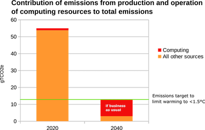

# 5. Addressing the elephant in the room

The two refined and approved carbon-aware way we explored in [when does carbon-aware software make sense?](when-does-carbon-aware-make-sense.md) don’t stand to gain us much if we are not also tackling the big question: **what proportion of the world’s resources is it acceptable for tech to use?**

The danger of the key takeaway from ways 1 and 2 is that we believe we can safely continue with business as usual. We can build massive AI products, keep growing our data centres and enjoy the benefits of limitless personal compute potential as long as they are optimised for efficiency.

In this section we look at the bigger picture of tech's carbon emissions and consider carbon-software approaches within that context.

### The global emissions picture

Let's start with the big picture of tech's problem space when it comes to carbon emissions.

> “The current emissions from computing are about 2% of the world total but are projected to rise steeply over the next two decades. By 2040 emissions from computing alone will be more than half the emissions level acceptable to keep global warming below 1.5°C. 
>
> 
>
> This growth in computing emissions is unsustainable: it would make it virtually impossible to meet the emissions warming limit. Plus, the emissions from the production of computing devices far exceed the emissions from operating them. So, even if software is more energy efficient, producing more of them will make the emissions problem worse.” 
>
> <a href="https://www.dcs.gla.ac.uk/~wim//low-carbon-computing/index.html">Low carbon and sustainable computing</a>, by Professor Wim Vanderbauwhede

<a href="https://docs.google.com/spreadsheets/d/e/2PACX-1vSd8nYugza3UjPaG8Y6DP8Fufq4JxWDDn8cdSQXq7KyfeXkbLvc3XC9uDxyXr5dkA/pubhtml">Two models created for this article by Professor Vanderbauwhede</a> show that the real problem our planet faces is not how we optimise our compute via patterns like carbon-aware compute, but how we change the alarming growth trend in computing driven electricity demand.

### Model one

The first model shows that because carbon-aware computing does not assume energy demand reduction, only greener compute whatever the demand, it will hardly slow down our race to <a href="https://en.wikipedia.org/wiki/Tipping_points_in_the_climate_system">planetary tipping points</a>.

Today's predicted growth for computing results in a 3 times increase in emissions by 2040 - most of the planet's carbon budget. With our suggested adjustments to carbon-aware computing in [ways 1 and 2](when-does-carbon-aware-make-sense.md), it will be 2.8 times. That 0.2 factor is small, but it does matter. Every single reduction buys us days, months, years before irreversible milestones. 

**But it is hardly the solution. The elephant in the room is not being addressed.**

### Model two

The second model looks at the potential reductions from location shifting. 

Realistic scenarios for location shifting give around 3% reductions in emissions from computing electricity use. This assumes there are no issues with demand, capacity and curtailment (!). This reduction ends up being small because of the overhead in location shifting and the embodied carbon of the required excess capacity.

In contrast, if we achieved a 50% demand reduction in computing electricity use, we would see emissions reduce to 20% of today's current level. Add in our suggested improvement to carbon-aware software, and the model suggests that reduced to 18%. 

We think this the level of urgent, drastic kind of reduction level we need that we represent as way 3.

_A visualisation to illustrate the gains from the different approaches outlines in this post. Courtesy of Professor Wim Vanderbauwhede._
 

## Way 3: Demand shaping computing electricity use so it stays within agreed resource use boundaries

> **TL;DR:** The core question that should be on all responsible technologists’ minds: is my compute’s net electricity demand _actually_ reducing by a significant percentage?  Data centres should interact with grids and seek assent to use electricity or other resources in a dynamic way, against a specific resource budget.

It cannot be understated that one of the biggest shifts required to reduce carbon emissions in line with the <a href="https://en.wikipedia.org/wiki/Paris_Agreement">Paris Agreement</a> is to accept that we cannot continue to grow everything without some limitations. 

At a computing/digital tech industry level, we need to accept there should be limits to the amount of resources consumed. At least in the short-term whilst we wildly exceed the world’s carbon budgets and need to drastically reduce our emissions.

This raises some important questions about what we are using all this tech for. And how do the Big Tech companies justify the growth?

Let's take a brief example of the recent explosion of AI (or rather <a href="https://homepages.cwi.nl/~steven/Talks/2023/11-09-aarhus/">it's really Machine Learning as Steven Pemberton explains</a>) throws many justifications for how ML/AI is needed to help us solve climate change. The counter argument here is that we already know how to solve climate change. <a href="https://drawdown.org/">Project Drawdown</a> published a comprehensive body of work in 2017 drawing on humanity’s collective wisdom about the practices and technologies that can begin to reverse the buildup of atmospheric carbon by mid-century. The short answer is that the solution to climate change is blocked by <a href="https://latitude.plos.org/2021/10/at-its-core-the-climate-crisis-is-a-crisis-of-politics-and-justice/">a lack of political will</a>, not technical solutions. AI will not help us with that.

### Finding the resource boundaries

We argue that testing these arguments is where the real, impactful work lies. Other efforts, whilst they may yield some small benefits, are just tinkering in the margins.

One course of action is to prioritise where compute's resource usage goes and make sure it happens in a fair and equitable way across all nations. What those budgets should be, and for what types of compute activity will require much policy work and cross-sectoral collaboration. 

The concept of improved carbon-aware computing could be potentially play a hugely helpful role. Especially if data centres interact with grids and seek permission to use electricity or other resources in a dynamic way, as we described in [way 1](when-does-carbon-aware-make-sense.md).

However this happens in practice, and what hurdles need to be overcome, this is a vital step. We must put checks and balances in place to shape computing’s demand and ensure the basic human needs of a local population are met before the profits of Big Tech.

## Next section
Continue the journey: [Where do we take carbon-aware from here? Introducing grid-aware computing](grid-aware-computing.md)
