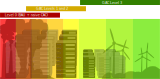

# 6. Where do we take carbon-aware from here? Introducing grid-aware computing.

If the assumptions made through this post are correct – please do reach out if you have something to add, contributions would be most welcome – we are entirely justified in promoting the next version of carbon-aware computing. 

**For argument’s sake let’s call it grid-aware computing for now.** This would be the version that addresses the realities of what is impactful and what isn’t given the real-world constraints of managing electricity grids and existing with tight global carbon budgets.

> ### Quick reference – Grid-aware computing 
> 
> The next proposed iteration of carbon-aware computing that helps developers address the impact of computing shift in ways that make actual net reductions to the emissions associated with local and global electricity grids. 
> The key approaches are:
> 1. Run compute when demand is low, targeting curtailed green electricity in stable grids.
> 2. Run compute on additive electricity.
> 3. Demand-shape computing electricity use so it stays within agreed resource use boundaries.

## Grid-aware computing: avoiding the greenwashing trap

This blog has, above all, identified that the version of “carbon aware computing” as currently presented, promoted, and increasingly marketed by more and more Big Tech companies, is not actually a trustable contribution to the environmental impact of computing. On the contrary, we argue that it is mostly ineffective and full of unacknowledged risks. This is not a judgement of intent. Whether implemented in good faith or not, the effect is to signal a green step forward, which we think in most cases is not a step at all, and in some cases it's not green.

If we think of our three proposals for grid-aware software (GAC) in relation to Business as Usual, including current carbon aware computing (CAC), this is what we envision:

Endorsing the current carbon aware paradigm without question, verification or risk analysis opens the door to a technically subtle and dangerous new wave of greenwashing. We are still on time to inject caution and nuance into carbon-aware discourse, and more crucially, into its implementations.

This is not to discredit current efforts, but to de-risk them and improve them, before the current concept, without warning labels or risk mitigations, gains enough traction to add brand value and scale up, without guardrails. By then it will be too late and we will learn the consequences through hindsight.

As of now, whenever you read: we have made this app carbon aware, or timed this compute job to when the grid is greenest - unless there is some actual evidence of impact, assume that the announcement will make little to no positive difference to emissions. And if the implementations really scales, consider it is likely to damage both the climate and grid stability/access, with all the economic and social consequences.

We have done our best to outline a constructive, more careful approach, building on what’s already there with an eye to what lies ahead. Our hope is we can capture the current desire to make software more carbon-aware but make it more effective, drastically reducing its risks, and significantly increasing the likelihood of climate benefits. 

We’ve named this approach “grid-aware computing” to emphasise that what matters is our overall systemic impact on the grid, rather than the carbon intensity metrics at any given time, or the emissions of any given compute job.So let us by all means embrace, experiment and innovate with our proposals 1 and 2 for improved carbon aware computing: it is potentially useful and impactful. But in doing so let’s not make the automatic assumption that we’re prioritising the right work.

**The grid-aware approach means that we should never let carbon aware implementations of specific compute tasks distract us from the central, constant question at the heart of our third proposal: _is our compute’s net electricity demand reducing?_**

## Next section

Continue the story: [What can you do to help?](how-can-you-help.md)
