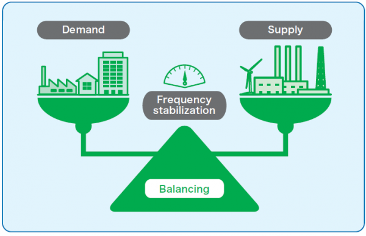
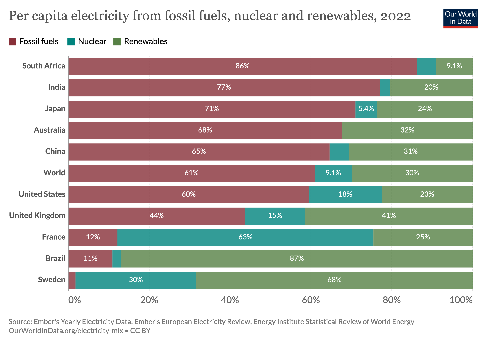
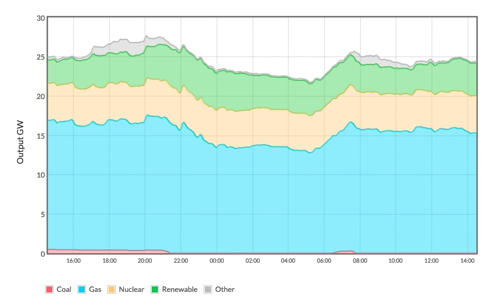

# 2. What software engineers need to know about how the grid works

What’s so potentially wrong about shifting compute loads in response to carbon   intensity? To answer this question, we need to start with a bird’s-eye view of how electricity grids work in practice. Once we have that understanding, we can start to see where the problems lie.

## How do electricity grids actually work?
The amount of electricity available on the grid doesn’t fluctuate freely. It’s controlled and planned in advance so that on any given day, there is a consistent amount of electricity available to use (aka supply). There are also controls to ensure a consistent amount of electricity being used (aka demand).

A key objective for those managing any grid is to monitor these two sides, supply and demand, and ensure they are in <a href="https://www.nationalgrideso.com/electricity-explained/how-do-we-balance-grid">balance</a>.

_Image courtesy of https://www.benext.eu/_

Any imbalances trigger <a href="https://www.powermag.com/2021-a-dark-year-for-electricity-security-reliability/">serious problems</a>, which are usually brought about by a change in the frequency. When the frequency suddenly spikes or dips, it can cause damage to electrical equipment, and ultimately brownouts and blackouts.

The expected demand for any given day is predicted using data. This allows the grid managers to ensure there is enough electricity available. There typically aren’t big demand differences from one day to the next. There is some daily fluctuation as people get up, go to bed, etc. But it’s usually predictable enough.

Seasonal differences also impact demand. For example, there is more demand in the winter months as days are shorter and colder, meaning people need more light and heat. But again, available data allows us to predict such fluctuations predictably.

_US electricity demand 1/1/2019 - 12/31/2019 - image courtesy of U.S. Energy Information Administration, <a href="http://www.eia.gov/beta/electricity/gridmonitor">Hourly Electric Grid Monitor</a>_

## Supply

Electricity supply is generated via three primary means:
 
1. 	Fossil fuels such as oil, coal, and gas
2. 	Nuclear
3. 	Renewables such as solar, wind, hydro, and geothermal
 
The proportions of electricity generated by each is referred to as the **fuel mix**. 

> ### Quick reference: Fuel-mix
> 
> The combined sources from which electricity has been produced. The average fuel mix varies from grid-to-grid. 
>
> 
> 
> _Source: Ember's Yearly Electricity Data; Ember's European Electricity Review; Energy Institute Statistical Review of World Energy. This representation is from <a href="https://ourworldindata.org/electricity-mix">https://ourworldindata.org/electricity-mix</a>_
>
> It also varies in each local grid, often on an hourly basis. On any given day, renewables will, in most places, represent a fraction of the daily supply. The rest will be made up from burning fossil fuels.
>
> 
>
> _The fuel mix of UK electricity supply 2:30pm 24 August 2023 to 2:30pm 25 August 2023 - image courtesy of <a href="https://electricityinfo.org/fuel-mix-last-24-hours/">https://electricityinfo.org/fuel-mix-last-24-hours/</a>_

## Techniques for keeping the grid balanced
There are two scenarios in which it would be necessary for those responsible for balancing the grid to take actions to ensure demand and supply stay balanced.

1. A decrease in demand – there’s less energy required compared to what’s being generated.
1. An increase in demand – there’s more energy required compared to what’s being generated.

Let’s use a few over-simplified, hypothetical examples to illustrate what options are commonly used to address these scenarios.

### A decrease in demand
**The scenario:** It’s a winter night in Paris, and at 8pm, everyone simultaneously turns off their lights. 

This is unexpected. There would be too much energy being put onto the grid, but nowhere for that energy to go because there’s no demand for it.

#### Option 1: Curtailment

To keep demand and supply in balance, a response is to decrease the amount of supply. This is known as **curtailment**.

> ### Quick reference – Curtailment
>
> Curtailment is a reduction in the output of a generator from what it could otherwise produce given available resources, typically on an involuntary basis. This might happen to balance energy supply and demand, or due to transmission constraints. <a href="https://en.wikipedia.org/wiki/Curtailment_(electricity)">Wikipedia</a>.

**What happens:** The most common way of curtailing electricity is to lower the price. This aims to incentivize suppliers to produce less, which would mean they “ramp down” or turn off some sources of supply.

This means energy suppliers have to make both an economic decision and a practical one. The practical part comes from the fact that not all sources of power scale up or down with equal ease. The table below comparing energy sources should help you understand why.

| **Energy source** | **Scalability** |
| --- | ----------- |
| Renewables – Solar, Wind, Hydro | Inflexible – You can’t just reduce the amount of wind blowing or the amount of sun from shining. |
| Nuclear | Less flexible – Significant safety and operational challenges with suddenly changing output. |
| Fossil Fuel – Coal | Flexible – Output can scale up or down, but becomes more expensive if more output is needed. |
| Fossil Fuel – Gas | Extremely flexible – Very quick to scale output up or down. |

In our example, Paris sits on the <a href="https://world-nuclear.org/information-library/country-profiles/countries-a-f/france.aspx">French grid which is significantly powered by nuclear power</a>. This source of energy is slow to react to sudden changes in demand. So, there could be scenarios where there might be more supply than demand, and the grid would still be out of balance.

### Option 2: Storage
Providers might look to store additional supply in batteries, <a href="https://en.wikipedia.org/wiki/Pumped-storage_hydroelectricity">pumped hydro</a>, or other mechanisms. 

**What happens:** Storing excess supply in batteries or through pumped hydro is another lever that can be pulled to bring balance to the grid. By directing the extra supply to a storage location, operators can buy themselves time to adjust overall supply to meet the new, lower demand.

When demand is high again, that stored energy can be put back onto the grid in a controlled manner.

But what if storage isn’t enough, or isn’t available on a grid? There’s one final option that is available to keep things in balance.

###  Option 3: Create artificial demand 

The grid uses incentives to artificially spike electricity consumption to grow demand and match the remaining excess in supply. This is called <a href="https://en.wikipedia.org/wiki/Energy_demand_management">demand management</a>.

**What happens:** The grid provides an incentive for businesses, though recently some consumer based schemes are being trialled, to increase their electricity use beyond what they might normally need. Most likely through a special tariff offering cheaper electricity at these times. By doing this, the grid can inflate electricity demand to the point where it is able to achieve a new balance between supply and demand.

Therefore, unplanned drops in electricity use, like the Paris light example, are highly unlikely to result in equivalent reduced emissions. Beyond a very specific, legally mandated range, the grid compensates for unplanned drops in a way that negates the savings. The net amount of emissions in any given day will be approximately the same in almost every case.

There's some interesting research and discussions going on about how data centers can be part of the solutions here. A great example to dive into <a href="https://academic.oup.com/ooenergy/article/doi/10.1093/ooenergy/oiad014/7329550">Stretched grid? Managing data center energy demand and grid capacity</a>, published Oct 2023.

### An increase in demand

**The scenario:** It’s an unusually hot summer night in Tokyo, and at 8pm everyone simultaneously turns on their air conditioners. 

This is unexpected. There would be too much energy being asked for, i.e. too much demand, and not enough energy supply to meet it.

**Options:** The techniques for managing these sudden increases are largely the reverse of the above. 

- Increase the price to incentivize providers to put more supply onto the grid. 
Remember from the table above, renewables and nuclear do not scale easily. So, supply during unplanned demand spikes often comes from fossil-fuel sources, which produce more carbon emissions.
- Use whatever is available in storage – batteries or pumped hydro.
- Offer incentives to artificially reduce demand.

Therefore, unplanned spikes in electricity use, like the Tokyo air conditioner example, are highly likely to result in increased emissions. This is a result of the need for energy providers to quickly ramp up supply to match demand, and the fact that this is most easily done by using fossil-fuel energy sources – often gas, sometimes coal.

## Ultimately, it helps to avoid unplanned peaks and troughs

We can see from this that unplanned spikes or drop-offs in demand aren’t good for grids. Unplanned drop-offs don’t actually reduce the amount of electricity being generated, so have no net impact. Unplanned surges have to be met and usually are met with ramping up fossil-fuel production.

Additionally, the very act of rapidly ramping up or down supply adds extra emissions. Many power sources are designed for steady-state conditions so sudden changes can lead to inefficient operation. Ramping up can also bring older and less efficient plants online. These are used as "<a href="https://en.wikipedia.org/wiki/Peaking_power_plant">peaking plants</a>" to meet sudden surges in demand. Start-up and shutdown processes can also be extra intensive. 

All this means extra emissions on top of producing the additional electricity itself. It might be minor, and mitigated by the transition to battery power, but is nevertheless an additional negative effect of this scenario.

## Next section

Continue the story: [What’s the problem with carbon-aware software then?](problem-with-carbon-aware-software.md)