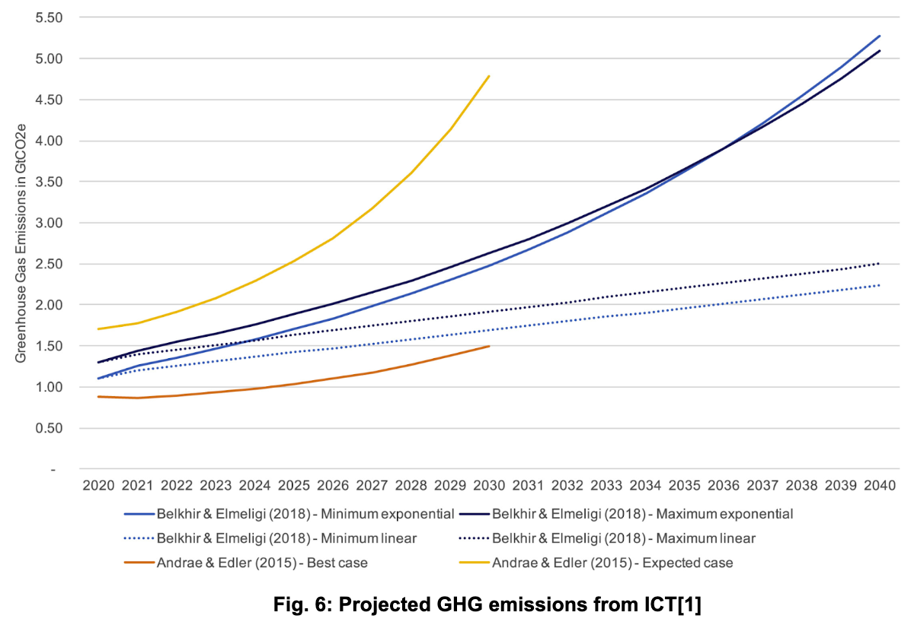

# 4. When does carbon-aware software make sense?

Let’s be absolutely clear on the answer to the question “is carbon-aware computing just bad?” No. We don’t intend to bash the core concepts of carbon-aware software. 

The core concept that shifting compute jobs to respond to the electricity available is sound.

**The criticism is that current approaches never apply any warning labels.**

We fail to mention that time and location shifting patterns are only helpful in certain circumstances, futile in most, and potentially harmful in others. There is a general assumption that time and location shifting are a greener way to run compute, with no verification and no risk mitigation. 

We are concerned that the current approach is actually hampering tech’s sustainability efforts even when meaning to assist them. First, by messaging that any company that adopts time and location shifting is now a little greener, a recipe for green washing. Second, by promoting patterns which, if adopted at scale without any risk analysis or mitigation are likely to be harmful. 

Most crucially we don’t see carbon-aware software meaningfully addressing the elephant in the room. **The environtal challenge of computing is not primarily one of energy optimisation, but of energy demand.**

For the best part of a century the amount of electricity consumed by the same computing job has become exponentially smaller. This should in theory mean the technology sector is greener than it has ever been. But these extraordinary <a href="https://doi.org/10.1016/j.patter.2021.100340">gains in efficiency have been dwarfed by the increases in computing electricity demand</a>. 

Carbon aware computing is a novel form of optimisation. It seeks to do essentially the same compute using less fossil-based electricity, by targetting more renewable energy. But any gains from such optimisation will be meangingless if our electricty demand grows faster than our optimisation gains.  

We think there is a way to reframe carbon-aware computing to address both, optimisation and demand, and not merely make cosmetic improvements to Business As Usual. The damage of runaway climate change to populations around the world demands that we do better, and we believe the tech sector is <a href="https://rtl.chrisadams.me.uk/2023/07/comparing-what-is-spent-on-share-buybacks-vs-the-cost-of-decarbonising-the-grid/">well resourced enough to tackle this in a meaningful way</a>.

## How can we make carbon-aware computing work?

There are two ways in which the logic of the carbon-aware approach can indeed reduce emissions.

**Way 1:** Time-shifting or location-shifting compute to when demand is naturally low and then using electricity that would otherwise be curtailed. This is very close to the current approach, but it prioritises electricity demand over electricity mix.

**Way 2:** Having computing jobs run on renewable electricity that is additive to the grid. 

The shortest authoritative summary of this reasoning is from a <a href="https://www.whitehouse.gov/wp-content/uploads/2022/09/09-2022-Crypto-Assets-and-Climate-Report.pdf">White House investigation into crypto mining</a> (see page 24). The relevant part says:

> "There are two primary ways.... using grid electricity would result in zero direct GHG emissions:
>
> 1) constructing or contracting for new clean electricity sources or
> 
> 2) using existing renewable electricity that would otherwise be curtailed by the grid.
>
> When... electricity [comes] from existing renewable sources, it displaces the GHG emissions in the near-term, shifting users of renewable sources to fossil fuel sources. This is because coal and natural gas often supply electricity generation for each additional unit of electricity demanded in the United States. As the amount of renewable sources is held constant, but electricity demand increases, additional fossil power will likely be dispatched. This displacement results in no net change or in increases in total global emissions through a process called leakage.”

Based on the above, we have 3 proposals for a new approach to carbon-aware computing, to maximise its positive impacts and mitigate its risks, two of which we outline in this section.

### Proposal 1: Run compute when demand is low, using curtailed electricity in stable grids

> #### TL;DR:
>
> We propose as a refinement to current carbon-aware time-shifting or location-shifting approaches to **prioritise demand intensity first and carbon intensity second**. 

Low demand times are most likely to coincide with times of excess renewable energy, which would otherwise be curtailed, which is to say wasted, to maintain grid stability. This is precisely the scenario where time-shifting and location shifting actually translates into emissions reductions from compute. Our compute runs on renewable electricity no one else will use, and thus will not generate direct emissions.

As we explored in [what software engineers need to know about how the grid works](how-the-grid-works.md), targeting low demand times has intrinsic environmental benefits independently of how much of the grid is running on renewables. It can play a part in helping the grid avoid ramp-ups/downs and contribute to grid stability, both of which have environmental, social and economic benefits.

If we schedule our compute based on grid demand in a highly predictable, stable fashion we don’t create unpredictable daily spikes and we maximise the chances of running on otherwise curtailed renewable energy and actually reducing our emissions.

**_How is this different from the current prevailing approach of targetting low carbon-intensity times in the grid?_**

As an example, an area with strong solar infrastructure might have a greener energy mix on sunnier, hotter periods of the day. That is also when people might be at work, so you would have both, a greener mix, and medium demand. At this tinme, the solar energy will be fully utilised, and there will be no exceess/curtailment.  A carbon intensity API might suggest 11 am is a good time to run your compute, but it will not reduce emissions at all. It might make no difference, or, if the electricity demand from compute jobs is large enough at 11 am in response to that API, the likelihood of requiring additional fossil fuels is much greater, meaning you are adding emissions.

Furthermore, because renewable energy supply, unlike electricity demand, is so unpredictable, timing a lot of compute to trigger when grid carbon intensity is low will add unpredictability to the grid, risking instability, hugely increasing the chances of perverse effects, environmental, social and economic. 

Which is to say there is no obvious scenario where targeting low demand times is not positive for the environment, but there are many scenarios where targetting grid carbon intensity will be ineffective or harmful.

**_A demand-first approach is not incompatible with current carbon aware approaches and tooling._**

Once we have prioritied low demand times, we can still use existing APIs or data sources to target low carbon-intensity triggers. 

In this scenario our compute jobs would never run at 11 am, even if grid carbon intensity is low, because we would know the chances of curtailment are remote. But they might run at 4 am on a windy storm, and not at 5 am when the winds have calmed, maximising even more the likelihood of running on otherwise curtailed energy and reducing our emissions.

These approaches are not incompatible. What if we first looked for grids that currently have low demand AND then sought those with a period of naturally high renewable electricity production? 

**_Warning Labels Remain_**

The above has merit when happening at a relatively small scale. But if everyone does this at the same time? Then we *still* have the problem of creating demand spikes, one our core worries about the current approaches. Whether just time shifting or also location-shfting, at scale, this low-demand-first approach is dramatically safer than the current one, but it still carries risks which must be assessed and mitigated. 

**_A call for innovation_**

Thinking about the challenges of large scale demand and carbon aware computing carries risks, but also opportunities. The current stage is experimental, fragmented and dispersed. But there is room to take the approach even further and imagine a long-term goal. Let’s make it standard that our compute jobs, and their underlying infrastructure, interface with grids in a systemic way and become part of the solution rather than the problem. These ideas fall into the realm of **demand management**, which we touch on in [what software engineers need to know about how the grid works](how-the-grid-works.md). 

There are many experiments ongoing in this area, some at significant scale, but we need a more holistic vision at the policy, business, technical, operational and infrastructural level of what is possible, what is necessary, and what it should look like.  By interacting with grid management systems, ideally in an automated, collaborative, and democratic way, we could harness the synergies between the demand management challenges of scaling up renewable electricity, and reducing the emissions from compute. 

Democratic here is key, as we all have a stake, are and and will be impacted by these interactions. This can’t just be the realm of the Big Tech players. We all need a chance to participate through open source standards, protocols and public engagement and participation. 

We explore these ideas further in [addressing the elephant in the room](elephant-in-room.md).

### Proposal 2: Run compute on additive renewable energy

> #### TL;DR:
>
> To be in any way effective, computing must target green energy sources that are in fact additive, and transparently address and mitigate the risks of perverse effects.

There are two common ways running compute on additive renewable energy can be achieved. 

> ### Quick reference – Additive renewable energy 
>
> “Additive” or “additional” renewable electricity means your purchase is financing new renewable electricity that would otherwise not exist. Related is applying the principle of "<a href="https://www.electricitymaps.com/blog/what-is-additionality-and-emissionality">additionality</a>" to renewable energy generation, particularly in <a href="https://en.wikipedia.org/wiki/Carbon_emission_trading">carbon markets</a>. 
>
> If your compute consume 50 terawatts of electricity and you pay for new solar panels that generate 50 terawatts of electricity, you achieve additionality. You can claim, in theory, that your compute is emissions neutral. In practice <a href="https://kvenkatm.medium.com/we-need-a-better-way-of-purchasing-and-accounting-for-renewable-electricity-34c0ee66070e">it’s less clear-cut</a>, but this is the general idea.
>
> Traditional carbon markets often sell ‘carbon credits’ based on already existing renewable electricity. In this scenario there is no additionality. You are merely claiming the existing renewable energy production as yours and giving responsibility for the existing dirty energy production to someone else. This is not reducing emissions at all. 
  

#### Power Purchase Agreements (PPAs) and Renewable Energy Certificates (RECs)

The primary way that many organisations tackle this is through <a href="https://en.wikipedia.org/wiki/Carbon_emission_trading">carbon markets</a>. These in turn sell two main instruments:  <a href="https://en.wikipedia.org/wiki/Renewable_Energy_Certificate_(United_States)">Renewable Energy Certificates</a> (RECs) and <a href="https://en.wikipedia.org/wiki/Power_purchase_agreement">Power Purchase Agreements</a> (PPAs). 

This remains a highly problematic approach. Why? Because <a href="https://www.spglobal.com/esg/insights/problematic-corporate-purchases-of-clean-energy-credits-threaten-net-zero-goals">the vast majority of RECs are non-additive</a>. 

They enable you to buy into the existing green energy mix, and simply take credit for their contribution. But you have zero effect on what’s called ‘**emissionality**’, which has similarities to the **displacement effect**. 

> ## Quick reference – Emissionality
>
> New renewable energy projects don’t always pull emissions out of the atmosphere. The reason they help is because they **displace fossil fuel power plants** that would otherwise keep polluting.
>
> But which projects are effective? That can vary greatly from project-to-project as well as the fuel-mix of the grid to which the project will be connected. For example, adding one more solar power purchase agreement (PPA) in California increasingly reduces output from a mix of natural gas plants and existing solar farms. But adding a new wind PPA in Wyoming nearly always reduces output at a coal plant, avoiding more emissions. This practice of comparing and acting on the avoided emissions of different renewable energy projects is called “emissionality.”
> 
> You can <a href="https://www.watttime.org/solutions/renewable-energy-siting-emissionality/">read more on this by WattTime</a>, who popularised the emissionality term.

PPAs are commonly employed throughout the business world, especially by <a href="https://www.datacenterdynamics.com/en/opinions/ppa-evolution-in-the-data-center-industry/">data centres</a>. Corporate purchasers make agreements with energy companies promising to purchase the power and RECs generated by the renewable project for a specific time period, often the next 10-15 years. 

While PPAs are often touted as a critical mechanism responsible for a company’s green credentials and central to its <a href="https://en.wikipedia.org/wiki/Environmental,_social,_and_corporate_governance">ESG strategy</a>, they can be misleading. Even if PPAs are attributed to particular renewable projects, <a href="https://www.datacenterdynamics.com/en/analysis/everything-data-center-operators-need-to-know-about-power-purchase-agreements-ppas/">they do not generally directly power data centres</a>. In other words, just because green electrons are being produced, does not mean those electrons are directly powering the compute within a data centre – despite often being <a href="https://www.electricitymaps.com/blog/green-electricity-contracts">touted as so</a>. There is also the risk of <a href="https://www.epa.gov/green-power-markets/double-counting">double counting</a>.

Therefore the best implementation of carbon markets involves ensuring that the renewable energy you purchase is *additive*.

### Your own renewable sources

A second, much rarer version of additionality - yet far more effective. 

Instead of purchasing some remote renewable infrastructure and “accounting” your claim to being powered by renewables, **actually** power your compute directly from your own renewable sources.

If your compute is being directly powered by your own solar panels or wind turbines etc., there is no sleight of hand or complex statistical projections. Your compute is effectively off grid to the extent that it is directly powered by your own renewable sources.

While preferable in terms of emissions, this approach is challenging to scale and risks perverse effects as we get into below. As with all choices proposed, it is important we do not simply advocate solutions, but address the risks and trade-offs. Warning labels are not stop signs. They are guides to responsible use.

**_Innovation with distributed alternatives_**

As a complement to this section, it’s worth mentioning there’s room to innovate direct renewable energy for compute at scale with distributed alternatives. Distributed compute and renewable electricity generation are growing in parallel and the room for synergy and innovation, environmental and commercial, is huge. We've pulled out some of the ideas/research around this into [Appendix 1](/appendices/appendix-1.md).

## Next section
Continue the journey: [Addressing the elephant in the room](elephant-in-room.md)